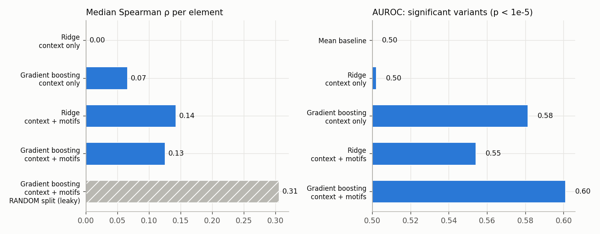
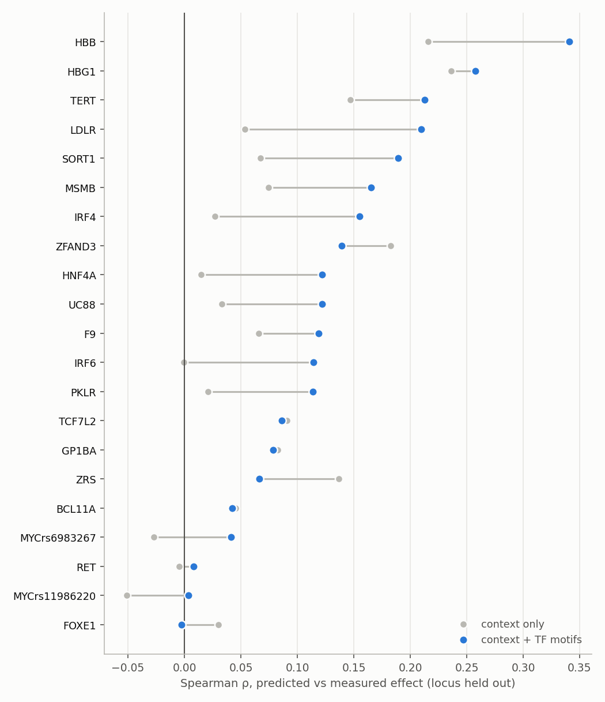
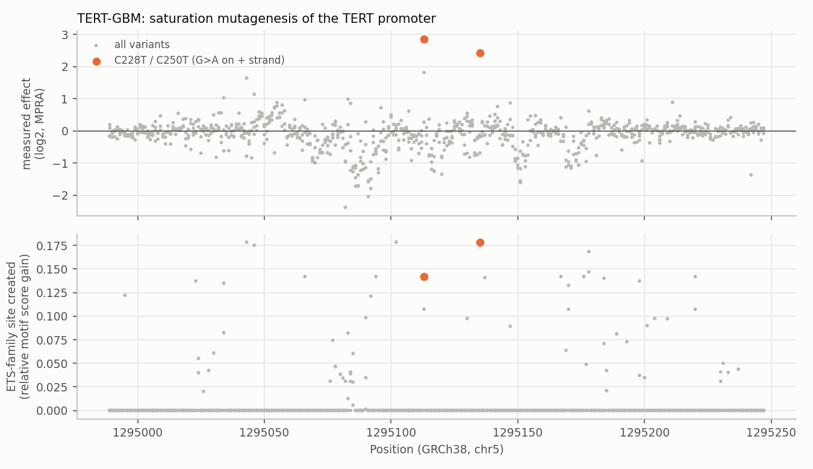

# RegulonML: predicting regulatory variant effects in promoters and enhancers the model has never seen

Can we predict how a single-base change in a promoter or enhancer alters gene activity, **for a regulatory element that was not in the training data**? This project tests that question on the saturation-mutagenesis massively parallel reporter assay (MPRA) of Kircher et al. (2019). Every possible single-nucleotide substitution and 1-bp deletion was measured in 21 disease-associated regulatory elements, giving 41,724 variant effects after quality control.

The model sees only DNA sequence: local sequence context, and how each variant creates or destroys transcription-factor (TF) binding sites, scored with all 1,019 vertebrate motifs in JASPAR 2026. It is evaluated with **leave-one-locus-out cross-validation**, so every prediction is for DNA the model has never seen.



## Results

| Features | Model | Split | Median Spearman ρ per element | AUROC, significant variants | AUPRC (baseline 0.18) |
|---|---|---|---|---|---|
| — | Mean baseline | leave-one-locus-out | — | 0.50 | 0.18 |
| Sequence context | Ridge | leave-one-locus-out | 0.00 | 0.50 | 0.18 |
| Sequence context | Gradient boosting | leave-one-locus-out | 0.07 | 0.58 | 0.21 |
| Context + TF motifs | Ridge | leave-one-locus-out | **0.14** | 0.55 | 0.22 |
| Context + TF motifs | Gradient boosting | leave-one-locus-out | 0.13 | **0.60** | **0.24** |
| Context + TF motifs | Gradient boosting | random 5-fold (**leaky**) | 0.31 | — | — |

"Significant variants" uses the original study's threshold (p < 10⁻⁵; 18% of variants). Spearman ρ is computed within each element and then summarised by the median, because effect sizes are on very different scales across elements (pooled R² is below zero for every model for the same reason; see `results/metrics.csv`).

**What this shows**

- **Generalising to unseen regulatory elements from sequence alone is hard, and the gains are modest but real.** The best models rank variant effects better than chance in 28 of 29 held-out datasets. They identify significant variants with AUROC 0.60 (AUPRC 0.24 against a base rate of 0.18). This is a hard benchmark: effects also depend on the cell line and on which TFs are present, and neither is visible in the sequence alone.
- **TF-motif features carry most of the signal.** Adding them roughly doubles the gradient-boosting model's median held-out correlation (0.07 → 0.13), lifts ridge regression from 0.00 to 0.14, and improves 15 of 21 loci.



- **A random split is badly optimistic.** Letting the same element appear in training and test (other alleles at the same position, or the same promoter in another cell line) more than doubles ρ to 0.31. It also produces a positive R² (0.51) that does not survive locus-level splitting. The first version of this project fell into exactly this trap, and worse (see below).
- **Biology check: the TERT promoter.** The two recurrent cancer mutations in the TERT promoter, C228T and C250T, are the strongest activating variants in the assay. They are known to work by creating new ETS-family (GABPA) binding sites. The motif scoring recovers this with no training at all: among 878 TERT variants, these two rank 3rd and 11th (joint) for ETS site creation. With TERT held out, the gradient-boosting model ranks C228T 15th of 878 for activation but misses C250T. Gain-of-function variants are rare in the training loci, so the model learns mostly how variants destroy sites.



## What changed from version 1, and why

Version 1 predicted the effect from features that included each variant's **DNA and RNA read counts**. Those are the measurements the effect is calculated from, so the target was leaking into the features. It also split train/test by dataset label, which let the same TERT, PKLR, LDLR and SORT1 DNA appear on both sides, and it used a single split with three test elements. Under a proper split every model did worse than predicting the mean (elastic net R² −2.3, random forest −19.7).

Version 2:

- uses **sequence-only features**; the read counts are used only for QC filtering, and a test enforces this
- **reconstructs each element's reference sequence** from the saturation-mutagenesis data itself, so no genome download is needed
- scores **TF binding-site creation and loss** for every SNV and deletion against all JASPAR 2026 vertebrate motifs, on both strands, with a vectorised scorer that is checked against a brute-force implementation
- groups datasets by **locus** and evaluates by **leave-one-locus-out cross-validation** with per-element Spearman, AUROC and AUPRC against explicit baselines
- reports the leaky random split next to the honest one, so the size of the leakage is visible

## Run it

```bash
python -m venv .venv && source .venv/bin/activate   # or a conda env with Python >= 3.10
pip install -r requirements.txt
bash run_real_mpra.sh            # ~8 min on a laptop: download, features, cross-validation, figures
python -m pytest -q              # 4 tests: motif scoring vs brute force, feature hygiene, split integrity
```

Outputs go to `results/`: `metrics.csv`, `per_element_spearman.csv`, `oof_predictions.csv.gz` (every held-out prediction), the three figures and `run_summary.json`. Feature building is cached in `results/features.parquet`; delete it to rebuild. The JASPAR database ships inside the `pyjaspar` package, so the only download is the 2.7 MB MPRA table.

## Method details

| Step | Detail |
|---|---|
| Data | Kircher et al. 2019, GRCh38 release; variants with ≥ 10 barcodes; 29 datasets from 21 loci (TERT ×4 cell lines, PKLR ×2 time points, LDLR ×2, SORT1 ×3, ZRS ×2 grouped as one locus each) |
| Target | fitted log2 variant effect; classification target p < 10⁻⁵ |
| Context features (55) | ref/alt base, deletion, transition, CpG created/destroyed, one-hot ±5 bp, GC in ±25 bp, relative position, promoter vs enhancer |
| Motif features (188) | per TF family: strongest site creation (alt relative score ≥ 0.90) and strongest site loss (ref ≥ 0.85), as change in relative motif score; global max gain/loss and counts; reference-only site annotation (number of strong sites covering the base, 21-bp site density) |
| Models | ridge regression (α by internal CV), histogram gradient boosting; logistic regression / gradient boosting for the significance task |
| Evaluation | leave-one-locus-out; per-element Spearman ρ, pooled AUROC/AUPRC; random 5-fold shown only as a leakage reference |

## Limitations and next steps

- Motif scores ignore which TFs are expressed in each cell line (HepG2, K562, HEK293T and others). Adding cell-type TF expression is the obvious next feature.
- A deep sequence model (e.g. Enformer or Borzoi predictions for ref and alt alleles) as an additional feature is the natural comparison with the motif-based approach.
- Only 21 loci: per-locus results are noisy, and the model rarely sees activating variants.

## Data and citation

Kircher M, Xiong C, Martin B, Schubach M, Inoue F, Bell RJA, Costello JF, Shendure J, Ahituv N. *Saturation mutagenesis of twenty disease-associated regulatory elements at single base-pair resolution.* Nat Commun 10, 3583 (2019). Motifs: JASPAR 2026 CORE vertebrates via `pyjaspar`.
